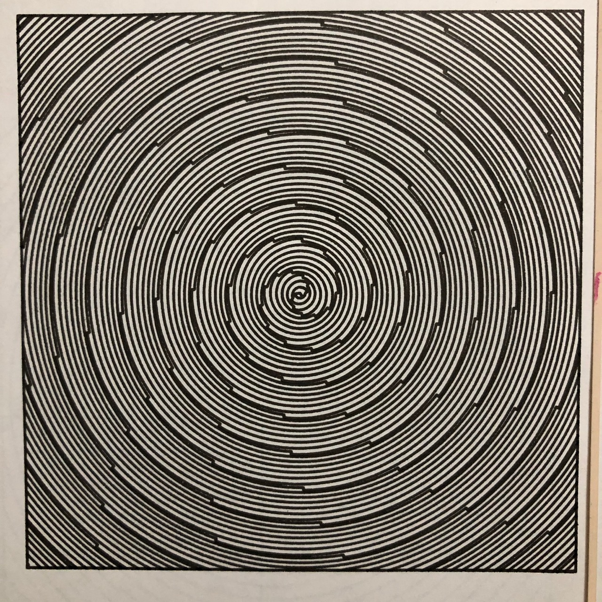
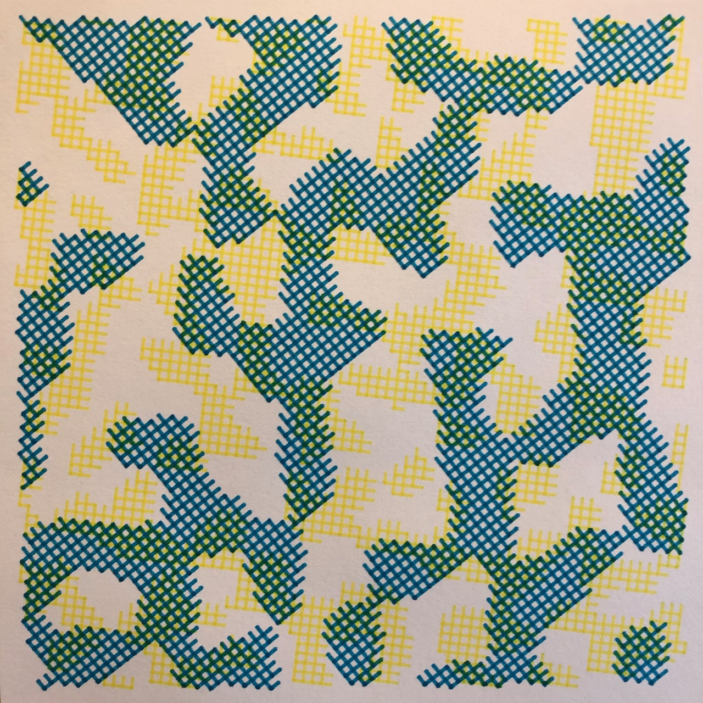

# plotter

This repo contains all of the files I use to create plotted drawings using my Axidraw plotter.

The [plot](plot) folder contains a library which I've written to make interfacing with the Axidraw easier. Its main feature is the `Plot` class defined in [plot.plot](plot/plot.py). This uses the Axidraw's Python interface and Python's builtin `turtle` library to allow me to preview plots and to make tasks such as resizing an entire plot much simpler. It also contains an algorithm to ensure that all plots are contained inside the plotter's available drawing area by clipping everything drawn outisde a defined bounding box.

The [plot.utils](plot/utils.py) module contains some useful functions and constants, as well as 2d and 3d vector implementations. The [plot.text](plot/text.py) module allows the plotter to draw text using an algorithmically defined font that I designed myself.

The file [run_plot](run_plot) is another utility that I use while I'm working on a plot. It watches the file I'm currently working on and automatically re-runs the plot when the file is saved. This makes the iteration process much faster. It also allows me to easily switch from running plots on the turtle preview to running them on the actual plotter.

Every other file in this repo is the source for a drawing I've made. A few example outputs are provided below.

### [grid_blob.py](grid_blob.py)

### [dither.py](dither.py)

This one converts an input image to greyscale, uses floyd-steinberg dithering to reduce it to 1-bit colors and draws a dot on every black pixel.

### [arc_test.py](arc_test.py)

### [waves.py](waves.py)

### [tie_dye.py](tie_dye.py)

